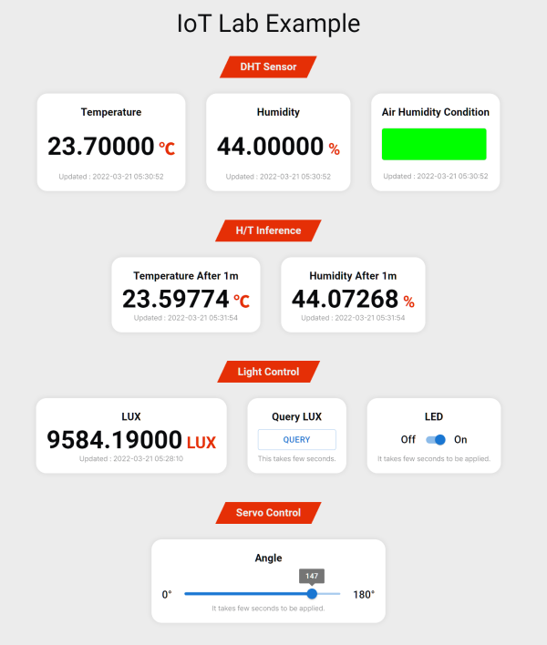
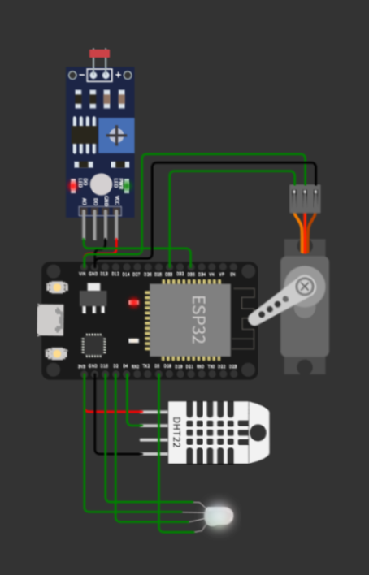

##    **IoT Lab**
*Includes ONNX runtime support on Node.js.* \
*Tested on wokwi.com ESP32 C++, for remote AIoT lab sessions.*

---

|               Web Panel Screenshot                 |                     Wokwi Simulator Diagram                  |
|:--------------------------------------------------:|:------------------------------------------------------------:|
|  |  |

---

### This Repository Includes:

- ESP32 C++ example code
- IoT web server with customizable control panels
- JSON-based DB (powered by `lowdb`)
- Remote PyTorch inference (powered by `torch-js`)

### How To Use IoT Control Panel:

1. Install node.js v16 or higher on your server.
2. Clone the repository on your server. `git clone https://github.com/wldh-g/iot-remote-lab.git`
3. Install the dependencies. `npm install`
4. Run the server. `npm run dev`
5. Go to `https://wokwi.com/projects/326257884268593746`.
6. Edit line 14, `your-ip-or-domain` to your server's IP address or domain. \
    If you are using port rather than `3000` on your server, also edit line 14, `3000` to your port number.
7. Run the simulation using the green start button.
8. Go to `http://your-ip-or-domain:port/panel/example`.
9. Enjoy!

### How To Use AIoT Remote Inference:

1. If you want to use a pre-trained model, skip to step 5.
2. Gather data named `humidity` and `temperature` from your IoT device (or wokwi simulator) into `db.json`.
3. Run `example/inference/dht_predict.ipynb` with your own `db.json`.
4. Save `humi_predict.onnx` and `temp_predict.onnx`.
5. Copy `.onnx` files and `model_map.yaml` to the root directory of this repository. \
    For the pre-trained `.onnx` files and `model_map.yaml`, please check `example/inference` directory.
6. Uncomment "H/T Inference" section of `pages/panel/example.tsx`. \
    i.e. delete two lines(`{/*` and `*/}`).
7. Re-run the server. `npm run dev`
8. Go to `http://your-ip-or-domain:port/panel/example`.
9. Enjoy!

Note that the pre-trained model is not accurate. It is just a simple example to show how inference can work.

---

Made with ♥️ by Jio Gim.
